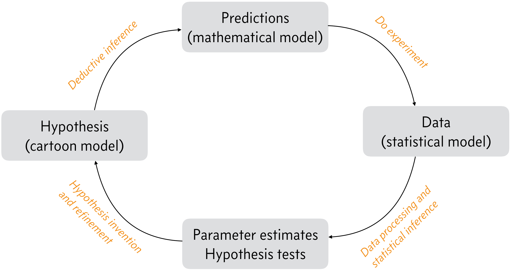

# 24/08/25

- "syllogism" - if "this" then "that" must follow



Zooming in on lower right arrow takes us to what we will focus on in this course.
```
[Data source]
│Data validation
╰─▶ [Validated data]
     │Data wrangling
     ╰─▶ [Tidy data]
          │Exploratory data analysis
          ╰─▶ [Data visualization]
               │Parameter estimation
               ├─▶ [Effect sizes, confidence intervals]
               │    │Hypothesis testing
               │    ├─▶ [p-values, inference intervals]
               │    │    │innovation, writing
               [Adjusted hypotheses/publication]
```


## Tabular tidy data
1. Each row is an observation
2. Each column is a variable
3. Different types of obs in defferent data frames

## Polars DataFrame operations that we will use
1. Filter - indexing to specific rows
2. Selection - do a calculation
3. groupby + aggregate

### Intro to Pivotting:
A table can be "wide" or "long".
Example:
```
# LONG:
| participant number | timepoint | measurement |
|--------------------|-----------|-------------|
| 1                  | pre       | 5.1         |
| 1                  | post      | 6.3         |
| 2                  | pre       | 4.9         |
| 2                  | post      | 5.8         |

# WIDE:
| participant number | pre | post |
|--------------------|-----|------|
| 1                  | 5.1 | 6.3  |
| 2                  | 4.9 | 5.8  |
```
is "wide" format.<br>
We can convert between the two.

# Plots:
## Data types:
1. Quantitative - continuous - floating point numbers
2. Ordinal - something with an order to it - discrete - integers
3. Temporal - time - dates - take into account time series nature
4. Geospatial - locations
5. Categorical - no inherent order

Another thing that was mentioned is the importance of always making an effort to show all the data points in a plot, not just summary statistics. He showed something about an **ECDF** instead of a **CDF** of **PDF** but I had to leave.

### Side comments:
> - **PyJanitor** - https://pyjanitor-devs.github.io/pyjanitor/
> - Pre-optimization is the source of all evil.

# 25/08/25
## What is "Probability"?
- **Frequentist:** probability is a long-term frequency of outcomes
- **Bayesian:** probability is a measure of plausibility. You can ascribe probabilities to any logical conjecture.


- `random variable`: a variable whose value is subject to variations due to chance (i.e., randomness).
- `bias`: systematic error introduced into sampling or testing by selecting or encouraging one outcome or answer over others (loaded dice for example)

## [Distribution explorer](https://distribution-explorer.github.io/)
Stories and explanations of different distributions.

- **Poisson process**: The amount of time until the next event ('arrival') in independent of the previous event.
- - Exponential distribution: models **the time between events** in a Poisson process.
- - Poisson distribution: models **the number of events** in a fixed interval of time or space in a Poisson process.

### Nonhomogeneous Poisson process
A Poisson process where the rate parameter $\beta$ ($\lambda$) is a function of time.<br>
$\beta = \beta(t)$<br>
... see notes on ipad pdf...


# 26/08/25
## Bayesian inference and Stan
- Read about "Generated quantities" block in the "Hello world" section in the notes
- Look at 70 - Sampling out of a bivariate Normal distribution
- Important issue: [The Funnel of Hell](https://wis-stats.github.io/lessons/principled/mcmc_diagnostics.html#the-funnel-of-hell)
